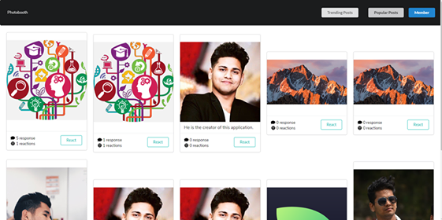
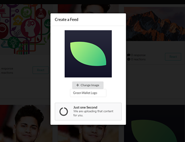
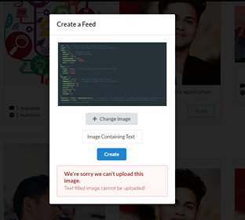
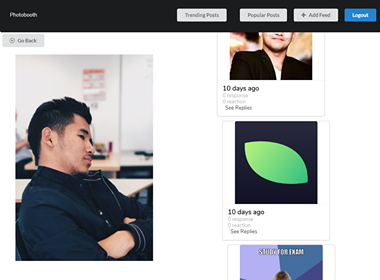
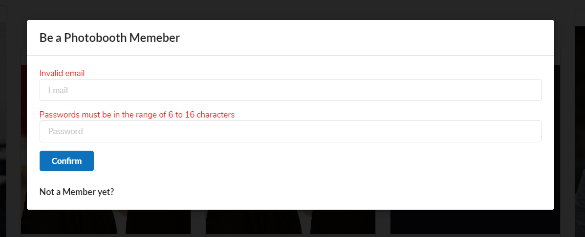
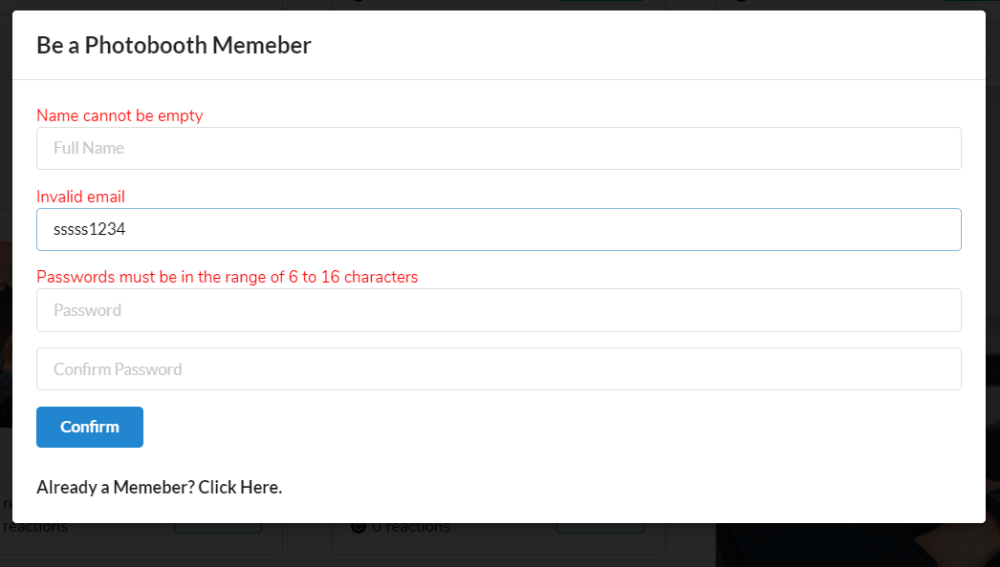
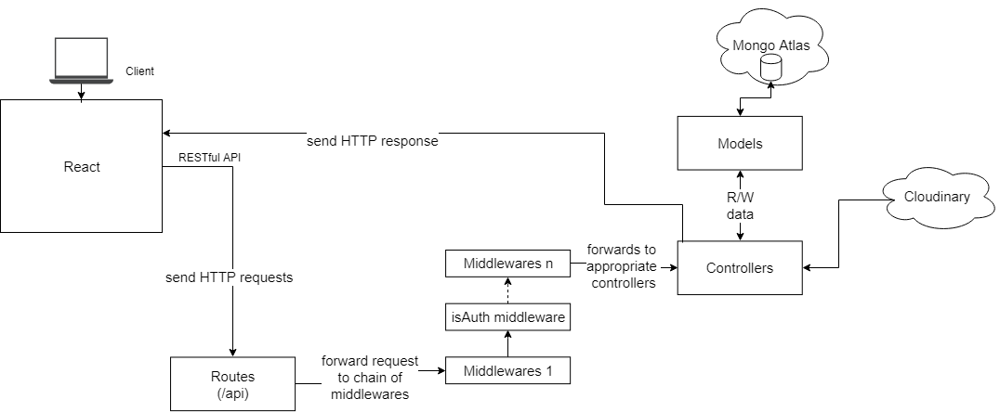
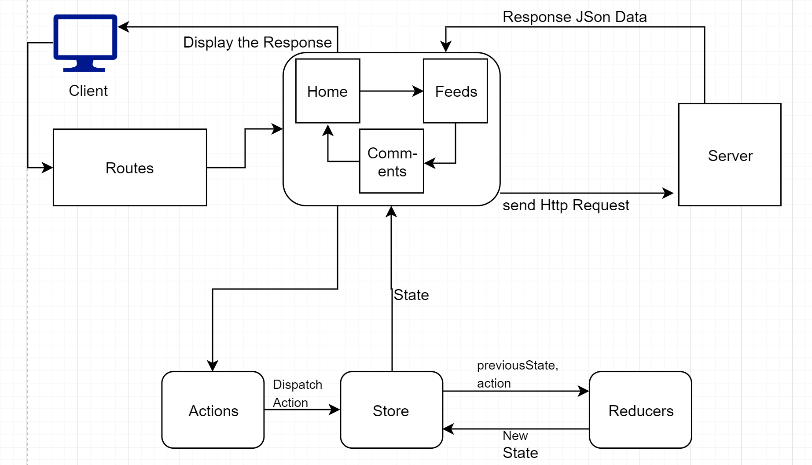

# PHOTOBOOTH

An application to communicate in an online community using images only rather than texts (No Adult Content).
This application was developed using the MERN Stack: MongoDB, Express, React and NodeJs. Furthermore Cloudainary was used to store and compress the images that were uploaded in the application.

# Screenshots:

​ **_Home Screen_**

​ **_Image with No Text Upload_**

​ **_Image with Text Upload_**

​ **_Comment Inside comment_**

​ **_Validation for login_**

​ **_Validation for Sign Up_**

# Installation and Setup:

- Clone this repository.

- Download and Install "NodeJs" and "npm" globally in your computer.

- NodeJs can be downloaded from `https://nodejs.org/en/download/` for your particular devices. "npm packet manager" is usually installed while installing NodeJs

- From the root folder of the application folder run

  `npm run dev`

- This will run the **server** and **client** concurrently.

- To run the **server** only.

  `npm run server`

- From the **frontend** folder to run the client.

  `yarn start`

## To start the project please add the following in the .env file

- CLOUDINARY_URL= your cloudinary api key goes here

- NODE_ENV = your environment model i.e. testing, development or production goes here

- MONGOURI=YOUR MONGO URI GOES HERE

- secret = YOUR SECRET GOES HERE

- GOOGLE_APPLICATION_CREDENTIALS = PATH TO THE JSON FILE FOR THE GOOGLE CLOUD VISON goes here

# Folder structure of the application

- The **server** and **client** are separated into the two **folders** i.e. **frontend** for the **client** and **root** folder for the **server**

- **Feeds** and **Users** are the based on the resources so it is under the api folder.

- The helpers folder has the most CRUD functionality for all the Feeds and Users.

- Under **helpers**, **imageUploader.js** is the uploader helper for Cloudinary so that it can be reused while uploading the images.

- Under **helpers** folder, **index.js** defines the routes for the application.

- For the **frontend**, all the reusable components are under the **app** folder which is under the **src** folder of **frontend** folder.

# Application Architecture

- Backend are based on the **Resource** Based Architecture.

  

- The application is a **resource** based so all the functionality are defined based on the resources. For example, the **Feeds** api are under the **Feeds** folder and **Users** api are under the **Users** folder.

* **Front-End**

  

  ​ **_Execution Architecture_**
